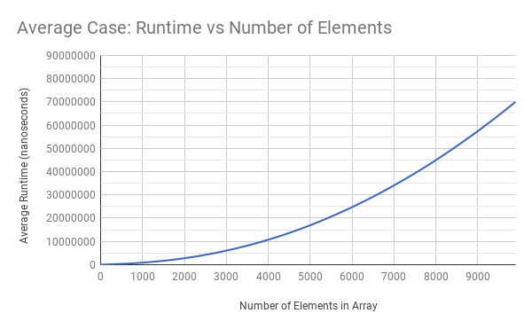
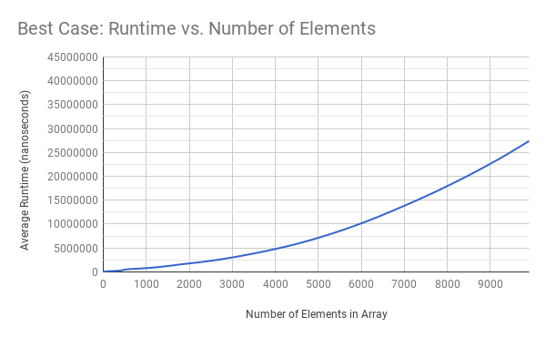

#### Team Conditionneur (Cheryl Qian, Stefan Tan, Lynne Wang)
#### APCS2 pd1
#### L01 -- What Does the Data Say?
#### 2018-03-13

## Hypothesis
The runtime for the best case and the average case is O(nlogn), while the runtime for the worst case O(n^2).

## Background
We were first introduced the partition method that the QuickSort method. We established that the partition method organizes all the elements less than the element at the pivot position to the left of it and all the elements greater than the element at the pivot position to the right of it. We then first used partition in a method that finds the yth smallest value in an array as fast as possible. The idea then came upon our class that we could use the partition method to sort an array of integers. We were also told to identify the runtimes of the average case, best case, and worst case, and with this lab we were told to prove it.

## Methodology
Using a QuickSortTester, we decided to use System.nanoTime(), which returns the time in nanoseconds from the most accurate system timer available. Since the computer runs the sorting algorithm quickly on small arrays, we decided to use an array that have a size of 100 to an array that has a size of 9900. for a total of 90 arrays, incrementing the size of array by 100 for maximal results. We also decided to do 20 trials of the quick sort algorithm to make sure outliers don't affect our conclusions. We inserted System.nanoTime() right before the sort and right after the sort to make sure no other processes affect our data. We subtracted the time we got after the sort and before the sort to find out how long the sort took. We then took the average times of the 20 trials for each array. We also used arrays that represented the best case, worst case, and average case to see how their runtimes compare and to see if it matches with our hypothesis.

For our best case scenario, we chose the median index as a pivot and used quicksort on arrays sorted in ascending order.

For our average case scenario, we shuffled the elements in our arrays and chose the median index to be the pivot.

For our worst case scenario, we chose the largest index as the pivot and used quicksort on arrays sorted in ascending order.

## Results

  

## Conclusions
- Assessment of Big Oh Runtime:
